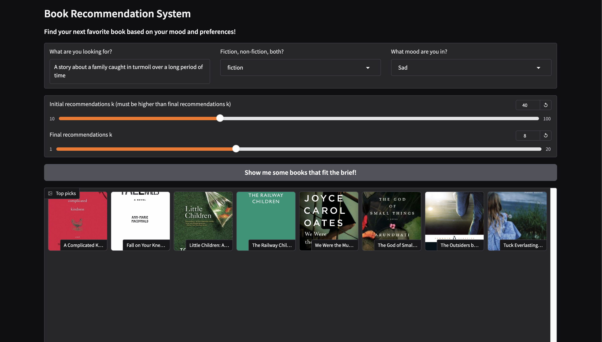

This project uses a vector database (Chroma) to perform similarity search on embedded book dsecriptions and recommend books accordingly, filtered on the categories of fiction and/or non-fiction and the tone of the description. Throughout the project, as outlined in the notebooks, there are quite a few techniques used commonly in NLP projects, including various forms of data cleaning and augmentation, primary analysis to understand possible bias scopes, zero-shot text classification using pretrained BART and sentiment analysis using fine-tuned DistilRoBERTa. The end result is a Gradio app that can take in a user query and a few parameters like category, emotion etc. to generate a few recommendations.

This is based largely on the tutorial [here](https://youtu.be/Q7mS1VHm3Yw?si=ev73DlkrbTk4y8di) with a few changes from my own experimentation! Most if not all credits are due there!

### TL;DR
- Cosine similarity on user query and book description embedding vectors
- Zero-shot classification of book category using bart-mnli-large
- Fine-tuned classification of emotion using emotion-english-distilroberta-base
- Gradio UI for interaction with model output

## Setup and run

Clone the repository using

```
git clone https://github.com/fayadchowdhury/semantic-book-recommender.git
```

Install the dependencies using Poetry (to install poetry, refer to the [official documentation](https://python-poetry.org/docs/))

```
poetry install
```

Set up an OpenAI project and obtain an API key and paste that in a .env file as

```
OPENAI_API_KEY="api_key"
```

To start the Gradio app

```
poetry run python3 app.py
```

The Gradio app is then available on http://localhost:7860

## Details

The idea behind this project is to find books with descriptions similar to the user's query or requirements. The descriptions are chunked by a CharacterTextSplitter, embedded using OpenAIEmbeddings and stored in a Chroma vector database. The user's query is also embedded using the same function and then a similarity search is performed against the vector database to return the top initial_k books with close descriptions. From there the system filters by category (fiction/non-ficiton/both for now) and ranks by the tone or emotion that the user is going for and returns the top final_k results with a thumbnail (displaying the cover-not-found asset photo if the URL does not exist) and a caption (author(s), title and first 30 words of description) in a Gradio UI.

### Dataset

The dataset in use is the [7k books dataset from Dylan J Castillo](https://www.kaggle.com/datasets/dylanjcastillo/7k-books-with-metadata). This dataset is constructed using the ISBNs from another dataset ([Soumik's Goodreads-books dataset](https://www.kaggle.com/jealousleopard/goodreadsbooks)) and querying Google Books API to extract the information. The author notes that there are several ISBNs that return invalid results which is why there are 6810 records instead of the 10352 records in the other dataset.

### Exploratory Analysis Findings:

- The columns or attributes in the dataset are: isbn13, isbn10, title, subtitle, authors, categories, thumbnail, description, published_year, average_rating, num_pages, ratings_count
- Of these, the columns of interest in building a semantic recommendation engine would be subtitle and description (assuming the user has no preferecnes for authors) but the subtitle column had quite a few null values (almost 2/3) so description proved to be the better choice (96% non-null)
- Some records in the dataset showed consistencies in the attributes they were missing (num_pages, ratings_count, average_rating), but they were not too instrumental in this project, so they could be ignored
- 303 rows where either num_pages, description, average_rating, published_year or any subset of these were missing were eliminated to have a more complete dataset
- While there was a long tail towards longer lengths of description, most were between 20 and 100 words long and so choosing a minimum cutoff of 25 words proved to be a good measure
- There were a lot of incredibly specific categories that applied to an incredibly small subset of books and they would be largely useless and lead to class imbalances for the classifiers, so only those categories that showed up more than 50 times throughout the dataset were analyzed and grouped into fiction and non-fiction while the rest were predicted with a classifier later in the pipeline

### Cleaning and augmentation

The raw books.csv dataset undergoes a series of cleaning and augmentation steps for completeness:

- Removing rows where num_pages, description, average_rating, published_year or any subset of those are missing
- Removing rows where the description is less than 25 words long
- Joining title and subtitle to form more concrete book names
- Adding "&fife=w800" to thumbnail URLs where they are present or replacing the URL with the location of the cover-not-found.jpg asset picture where they are missing
- Dropping unnecessary columns ("title", "subtitle")
- Mapping categories that show up more than 50 times throughout the dataset to either "fiction" or "non-fiction"
- Adding "fiction" or "non-fiction" category values to those missing those values using a zero-shot classifier
- Adding columns describing the score for each of the emotions of (after a mapping) "joy", "surprise", "anger", "fear", "sadness", "neutral" using a fine-tuned classifier

### Zero-shot category classification

Even after the category mapping to "fiction" and "non-fiction" there are quite a few records with those missing because their original categories where hyper-specific. In these cases, a zero-shot classifier was used to predict the category based on the "description" text.

The model used was facebook/bart-mnli-large and the label (out of "fiction" and "non-fiction") with the highest probability was chosen. The accuracy measured against categories assigned previously as ground truths was 65.5%, which was not the best but it could be made better with a more fine-tuned model.

### Fine-tuned emotion/tone classification

To assign emotions or tones, a fine-tuned classifier was used. j-hartmann/emotion-english-distilroberta-base was used in a text classification pipeline to generate emotion scores for the emotions "surprise", "neutral", "fear", "joy", "anger", "disgust" and "sadness" and those values were added as separate columns to each row.

In terms of accuracy, it achieves an evaluation accuracy if 66% compared to a baseline of 14% according to [this](https://dataloop.ai/library/model/j-hartmann_emotion-english-distilroberta-base/).

### Chunking, embedding and vector databasing

Normally, there are more effective chunking strategies than splitting on characters or a delimiter (semantic chunking for instance), each with its own use case. For this particular use case, where the description can be considered one continuous document/text body less than 200 words long (usually), a simple newline delimiter based chunking strategy works fairly well.

Embedding functions are used to numerically represent the text bodies they embed. Commonly OpenAI's text-embedding-ada-002 is used but SentenceTransformers and other LLM's embedding layers may also be used, the more domain-specific, the better. This project uses text-embedding-ada-002.

A vector database stores vectors along with some metadata, making it the perfect candidate to store NLP embeddings, which are many dimensional vectors, with some identifier metadata. This project uses Chroma as the vector store and also saves a local copy of it for persistence through future runs. During retrieval, a cosine similarity metric is used to compare the embedded user query against similar document embeddings and return the ones most similar.

### Gradio UI

The main app entry-point sets up a Gradio UI served at http://localhost:7860. As shown in the screenshot, the UI has

- A TextBos to take a user query
- A Dropdown to pick the category
- A Dropdown to pick the tone
- A Slider to set a value for initial_k
- A Slider to set a value for final_k
- A Button to take all of the inputs and pass them to the function to generate recommendations
- A Gallery that displays thumbnails and a caption associated with the books being recommended

This is a very basic UI and can definitely be made even better, but the purpose of Gradio is to quickly demonstrate the output of code without having to draw up complex frontends, making it very useful for demo-ing AI work.

### Logging

There are 4 handlers and 3 loggers used:

- console for DEBUG statements from the root app
- logs/app.log for DEBUG statements from the root app
- logs/models.log for DEBUG statements from the classifier models
- logs/etl.log for DEBUG statements from the ETL processes

The loggers are attached to from the individual modules and most of the logging is DEBUG statements for now, but there should be improvements to this in future iterations.

## Directory structure

While the initial experiments and all future experiments relevant to this project will probably be found in notebooks in the experiments/ folder, the actual app is a monolith with a single entry-point with components separated out into different folders. This section will serve as an overview since the individual files are decently documented.

- assets/ - This directory holds the static assets - the screenshot used in this README and the cover-not-found photo
- config/ - Currently this holds just the logger, but I plan to take a more object-oriented approach to this project where it may house more config objects
- data/ - This holds a few CSVs generated from the notebooks as well as an input/ directory housing the raw input data (books.csv), and running the app will also generate an output/ directory housing a vector_db folder and a few more CSVs resulting from the ETL process
- experiments/ - This houses the experimental notebooks
- logs/ - This houses the log files from the app, the ETL process and the classifier models
- processing/ - This houses most of the ETL code separated into extract.py, transform.py, load.py and an additional models.py to load and cache the classifier models
- utils/ - This houses a few utility functions separated out into reelvant files (UI functions in ui_functions.py for example)
- app.py - This is the single entry point and houses most of the constants, the entire control flow of the ETL process and the Gradio UI code
- poetry.lock - The Poetry lock file configuring the dependencies for this project
- pyproject.toml - This is where the dependencies are defined, or simply use poetry add <package_name>

## TODO

1. Fine-tune category classifier
2. Set up incremental/batch processing pipeline for future books
3. You tell me!
